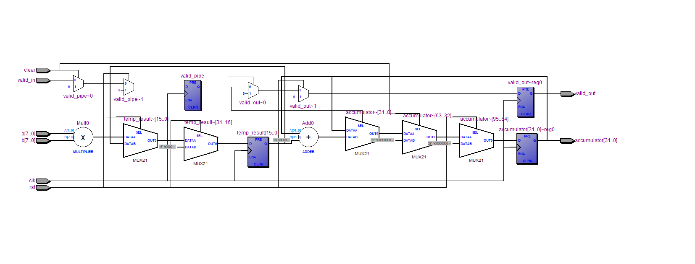
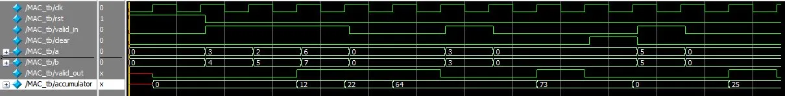

# Multiply Accumulate Unit (MAC)

A 2-stage pipelined Multiply Accumulate Unit implemented in SystemVerilog. A MAC computes the running sum of products. 
result = result + (A × B) 
and is the fundamental building block of neural network accelerators, DSP systems, and matrix multiplication engines.

## Architecture Highlights

**2-stage pipeline:** The multiply and accumulate operations are separated across two clock cycles. Stage 1 computes the product of A and B and stores it in an intermediate register. Stage 2 adds that result to the running accumulator. This separation prevents the non-blocking assignment timing issue where the accumulator would otherwise read a stale multiply result in the same cycle it was computed.

**valid_in / valid_pipe / valid_out handshake:** Three signals coordinate data flow through the pipeline. valid_in tells the MAC that the inputs are real data. valid_pipe is valid_in delayed by one clock cycle. It travels alongside the multiply result through the pipeline so Stage 2 knows when to accumulate. valid_out is valid_pipe delayed by one more cycle, telling downstream logic that the accumulator has been updated and its value is trustworthy.

**clear vs rst:** rst performs a full synchronous reset of all internal state including the accumulator. clear resets only the accumulator, allowing a fresh dot product to begin without restarting the entire module. This distinction is important in systems that compute multiple sequential dot products.

**Synthesized hardware:** The RTL Viewer in Quartus confirms the synthesizer correctly inferred a dedicated multiplier, pipeline registers, an adder, and MUX21 blocks for the reset and clear control logic.

## Pipeline Timing
Cycle N:   valid_in=1  → Stage 1: temp_result <= a * b, valid_pipe <= 1
Cycle N+1: valid_pipe=1 → Stage 2: accumulator <= accumulator + temp_result, valid_out <= 1
Cycle N+2: valid_out=1  → downstream can safely read accumulator

## Ports

| Signal | Direction | Width | Description |
|---|---|---|---|
| clk | input | 1-bit | Clock |
| rst | input | 1-bit | Synchronous reset, clears all state |
| valid_in | input | 1-bit | High when a and b contain valid data |
| clear | input | 1-bit | Resets accumulator only, pipeline state preserved |
| a | input | 8-bit | First operand |
| b | input | 8-bit | Second operand |
| valid_out | output | 1-bit | High when accumulator contains a valid result |
| accumulator | output | 32-bit | Running sum of products |

## Expected Results

| Operation | a | b | Expected accumulator | Notes |
|---|---|---|---|---|
| Reset | 0 | 0 | 0 | Initial state |
| Cycle 1 | 3 | 4 | 0 | Multiply in progress, pipeline delay |
| Cycle 2 | 2 | 5 | 12 | 3x4=12 accumulated |
| Cycle 3 | 6 | 7 | 22 | 2x5=10 accumulated, total 22 |
| Flush | 0 | 0 | 64 | 6x7=42 accumulated, total 64 |
| Gap | 0 | 0 | 64 | valid_in=0, accumulator holds |
| Resume | 3 | 3 | 64 | Multiply in progress |
| Flush | 0 | 0 | 73 | 3x3=9 accumulated, total 73 |
| Clear | 0 | 0 | 0 | Accumulator reset to 0 |
| After clear | 5 | 5 | 25 | 5x5=25, fresh accumulation |

## Verification

The self-checking testbench verifies three scenarios. Back to back valid data with no gaps confirms the pipeline handles continuous input correctly. A gap in valid_in confirms the accumulator only updates when valid data flows through and holds its value during idle cycles. A clear mid-simulation confirms the accumulator resets independently of the pipeline state, and accumulation resumes correctly afterward.

## Schematic

## Simulation Output
