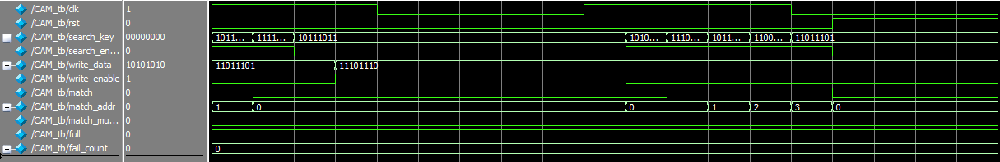

# Content Addressable Memory (CAM)

A parameterised Content Addressable Memory implemented in SystemVerilog. Unlike conventional RAM where you provide an address to retrieve data, a CAM works in reverse; you provide a data value and the CAM tells you which address holds it. Search across all rows happens simultaneously in a single clock cycle using parallel hardware comparators, giving O(1) lookup regardless of depth.

## Architecture Highlights

**Parallel search with combinational comparators:** Every row compares itself against `search_key` simultaneously in a single `always_comb` block. The for loop unrolls at synthesis time into DEPTH independent comparator circuits, all firing in the same instant. This is what makes CAM search fundamentally different from RAM i.e. there is no sequential scan.

**search_enable gating:** The comparator array runs continuously regardless of whether a search was requested — gating the comparators themselves would add unnecessary delay to the critical path. Instead, a separate combinational block gates the final outputs (`match`, `match_addr`, `match_multiple`) to zero when `search_enable` is low, protecting downstream logic from acting on stale or accidental matches when no search was requested.

**Priority encoder for conflict resolution:** When multiple rows match the search key simultaneously, the priority encoder resolves the conflict by returning the lowest matching address. A loop scanning from index 0 upward locks in the first match it finds, subsequent matches set `match_multiple` rather than overwriting `match_addr`. Internal signals (`match_int`, `match_addr_int`, `match_multiple_int`) hold the raw priority encoder result before the `search_enable` gate, keeping the two concerns cleanly separated.

**Auto-placement with oldest-eviction:** There is no `write_addr` input .The CAM manages its own placement. A circular `write_ptr` advances on every write, naturally filling empty rows first and then overwriting the oldest occupied row once the CAM is full. This is the standard replacement policy used in hardware lookup structures like TLBs, implemented here with zero additional control logic beyond the pointer itself.

**Packed valid bit vector:** `cam_valid` is declared as a packed vector `logic [DEPTH-1:0]` rather than an unpacked array, allowing the `full` flag to be computed in a single reduction AND operation (`&cam_valid`) and the reset to clear all valid bits in one assignment (`cam_valid <= '0`), avoiding unnecessary loops for both.

## Ports

| Signal | Direction | Width | Description |
|---|---|---|---|
| clk | input | 1-bit | Clock |
| rst | input | 1-bit | Synchronous reset, clears all valid bits and write pointer |
| search_key | input | DATA_WIDTH | Value to search for |
| search_enable | input | 1-bit | High when a search result should be trusted |
| write_data | input | DATA_WIDTH | Value to store |
| write_enable | input | 1-bit | High to trigger a write on the next clock edge |
| match | output | 1-bit | High when search_key was found |
| match_addr | output | log2(DEPTH) | Address of the matching row, lowest index if multiple |
| match_multiple | output | 1-bit | High when more than one row matched |
| full | output | 1-bit | High when all rows contain valid data |

## Parameters

| Parameter | Default | Description |
|---|---|---|
| DEPTH | 16 | Number of storage rows. Must be a power of 2. |
| DATA_WIDTH | 8 | Width of each stored value in bits |

## Internal Signals

| Signal | Width | Description |
|---|---|---|
| cam_data | DATA_WIDTH × DEPTH | Storage array, one entry per row |
| cam_valid | DEPTH | Packed valid bit per row, 1 means row contains real data |
| match_array | DEPTH | Per-row comparison result from parallel comparators |
| write_ptr | log2(DEPTH) | Circular pointer tracking next write location |
| match_int | 1-bit | Raw priority encoder match result before search_enable gate |
| match_addr_int | log2(DEPTH) | Raw priority encoder address before search_enable gate |
| match_multiple_int | 1-bit | Raw multiple-match flag before search_enable gate |

## Logic Blocks

| Block | Type | Description |
|---|---|---|
| Comparator array | always_comb | Populates match_array by comparing every row against search_key simultaneously |
| Priority encoder | always_comb | Resolves match_array into a single address and multiple-match flag |
| search_enable gate | always_comb | Passes or zeros the priority encoder result based on search_enable |
| Write logic | always_ff | Stores write_data at write_ptr on clock edge, advances pointer, manages valid bits |
| Full flag | always_comb | Reduction AND across cam_valid — high when every bit is 1 |

## Expected Results

| Test | search_key | search_enable | Expected match | Expected match_addr | Expected match_multiple | Notes |
|---|---|---|---|---|---|---|
| Fill 4 rows | — | — | — | — | — | full asserts after 4th write |
| Search existing | 0xBB | 1 | 1 | 1 | 0 | BB written to row 1 |
| Search missing | 0xFF | 1 | 0 | 0 | 0 | FF was never written |
| Search disabled | 0xBB | 0 | 0 | 0 | 0 | Gate forces outputs to 0 |
| After eviction | 0xAA | 1 | 0 | 0 | 0 | AA evicted by EE at row 0 |
| Evicted replaced | 0xEE | 1 | 1 | 0 | 0 | EE now at row 0 |
| Survivor BB | 0xBB | 1 | 1 | 1 | 0 | Untouched at row 1 |
| Survivor CC | 0xCC | 1 | 1 | 2 | 0 | Untouched at row 2 |
| Survivor DD | 0xDD | 1 | 1 | 3 | 0 | Untouched at row 3 |
| Multiple match | 0xBB | 1 | 1 | 0 | 1 | BB at rows 0 and 2, lowest wins |

## Verification

The self-checking testbench uses `DEPTH=4` to make the eviction scenario reachable quickly. The full is hit after 4 writes rather than 16, and the oldest-eviction wrapping is exercised on the 5th write. Two separate test phases are used: the first verifies core functionality including eviction and search_enable gating, the second resets to a clean state to construct a controlled duplicate-entry scenario that reliably places the same value in two known rows to verify `match_multiple` and priority encoder correctness. All outputs monitored via `$display` with fail-soft reporting.

## Simulation Output
